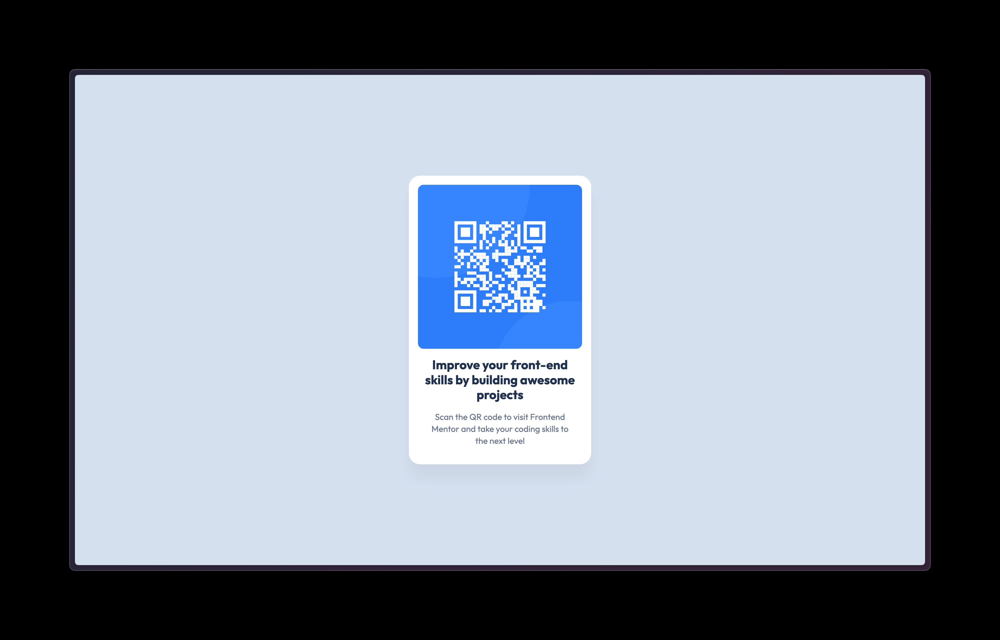

# Frontend Mentor - QR code component solution

This is a solution to the [QR code component challenge on Frontend Mentor](https://www.frontendmentor.io/challenges/qr-code-component-iux_sIO_H). Frontend Mentor challenges help you improve your coding skills by building realistic projects.

## Table of contents

- [Overview](#overview)
  - [Screenshot](#screenshot)
  - [Links](#links)
- [My process](#my-process)
  - [Built with](#built-with)
  - [What I learned](#what-i-learned)
- [Author](#author)

**Note: Delete this note and update the table of contents based on what sections you keep.**

## Overview

### Screenshot

### Links

- Solution URL: [Github Repo](https://github.com/galonaranjo/practice-qrcode)
- Live Site URL: [Vercel Deployment](http://qrcode-frontend-challenge.vercel.app)

## My process

### Built with

- Semantic HTML5 markup
- CSS custom properties
- Flexbox
- Mobile-first workflow

### What I learned

This whole process was not just about learning how to build the qrcode site, but also gave me some practice in git, creating a new repository, and creating a live site.

## Author

- Website - [Galo Naranjo](https://www.your-site.com)
- Frontend Mentor - [@galonaranjo](https://www.frontendmentor.io/profile/galonaranjo)
- Twitter - [@galonaranjo\_](https://www.twitter.com/galonaranjo)
